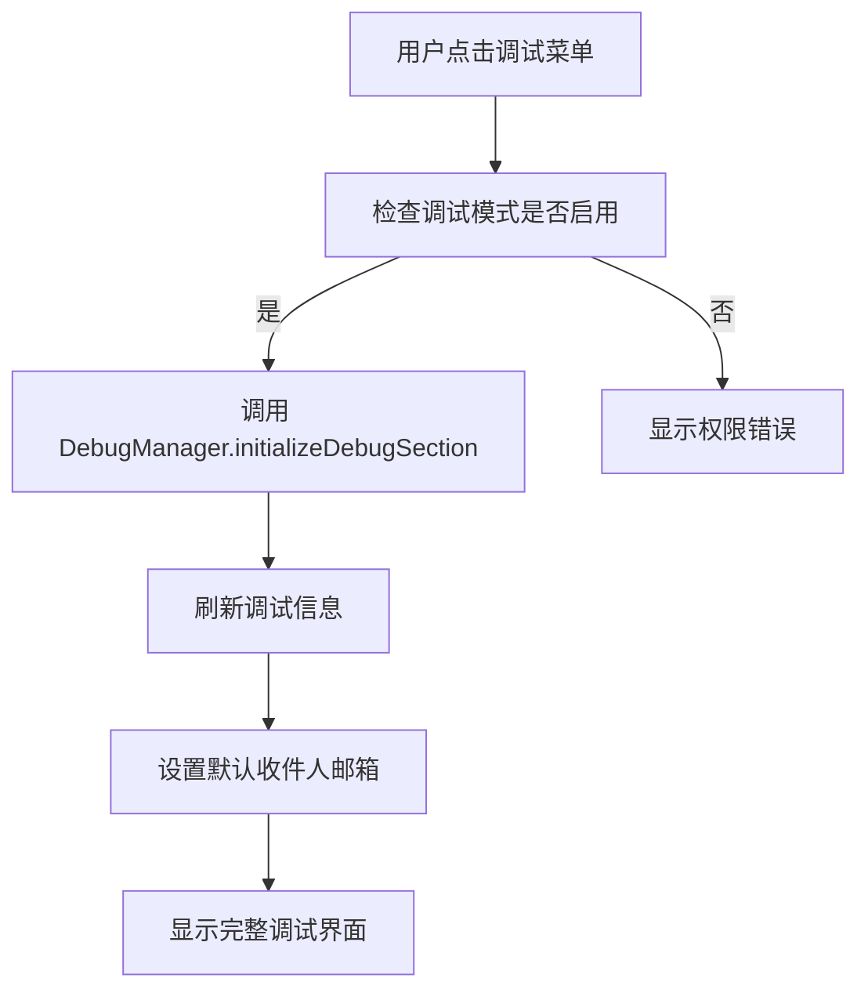
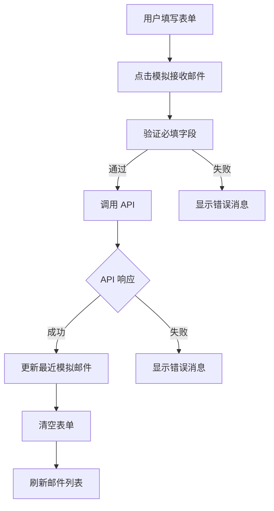

# 调试功能实现总结

## 🐛 问题描述

**原始问题**：调试信息一直显示"加载中"，缺少完整的调试界面

**问题根源**：
1. 调试部分只有简单的占位符 HTML
2. 缺少完整的调试功能实现
3. 没有模拟邮件接收功能
4. 调试信息显示不完整

## ✅ 解决方案

### 1. 完整的调试界面 HTML

**位置**：`src/templates/html-template.ts`

#### 新增功能模块

1. **模拟邮件接收表单**
   ```html
   <form id="simulateEmailForm">
       <!-- 发件人/收件人邮箱 -->
       <input type="email" id="simFromEmail" placeholder="sender@example.com">
       <input type="email" id="simToEmail" placeholder="user@your-domain.com">
       
       <!-- 邮件内容 -->
       <input type="text" id="simSubject" placeholder="测试邮件主题">
       <textarea id="simTextContent" placeholder="纯文本内容"></textarea>
       <textarea id="simHtmlContent" placeholder="HTML内容（可选）"></textarea>
       
       <!-- 操作按钮 -->
       <button onclick="simulateEmailReceive()">📨 模拟接收邮件</button>
       <button onclick="clearSimulateForm()">🗑️ 清空表单</button>
   </form>
   ```

2. **调试信息面板**
   ```html
   <div id="debugInfo">
       <p>调试模式状态: <span id="debugModeStatus">检测中...</span></p>
       <p>当前用户: <span id="debugCurrentUser">加载中...</span></p>
       <p>系统配置: <span id="debugSystemConfig">加载中...</span></p>
       <p>最近模拟邮件: <span id="lastSimulatedEmail">无</span></p>
   </div>
   ```

3. **调试工具按钮**
   ```html
   <button onclick="refreshDebugInfo()">🔄 刷新调试信息</button>
   <button onclick="clearDebugLogs()">🗑️ 清空调试日志</button>
   ```

### 2. 完整的调试功能实现

**位置**：`src/static/app.ts`

#### DebugManager 模块

```typescript
const DebugManager = {
    // 初始化调试部分
    async initializeDebugSection() {
        // 更新调试信息
        await this.refreshDebugInfo();
        
        // 设置默认收件人邮箱
        const currentUser = State.getCurrentUser();
        const response = await API.get('/api/system/config');
        // 自动填充用户邮箱地址
    },

    // 刷新调试信息
    async refreshDebugInfo() {
        // 更新调试模式状态 ✅
        // 显示当前用户信息
        // 显示系统配置摘要
    },

    // 模拟邮件接收
    async simulateEmailReceive() {
        // 获取表单数据
        // 调用调试 API
        // 显示结果反馈
        // 刷新邮件列表
    },

    // 清空模拟表单
    clearSimulateForm() {
        // 清空所有输入字段
    },

    // 清空调试日志
    clearDebugLogs() {
        // 清空控制台和调试记录
    }
};
```

### 3. 全局函数绑定

```typescript
// 调试功能绑定
window.simulateEmailReceive = DebugManager.simulateEmailReceive.bind(DebugManager);
window.clearSimulateForm = DebugManager.clearSimulateForm.bind(DebugManager);
window.refreshDebugInfo = DebugManager.refreshDebugInfo.bind(DebugManager);
window.clearDebugLogs = DebugManager.clearDebugLogs.bind(DebugManager);
```

## 🎯 功能特性

### 1. 模拟邮件接收

- **智能表单**：自动填充当前用户的邮箱地址
- **完整数据**：支持发件人、收件人、主题、文本和 HTML 内容
- **API 集成**：调用 `/api/debug/simulate-email` 端点
- **实时反馈**：显示成功/失败消息
- **自动刷新**：模拟成功后自动刷新邮件列表

### 2. 调试信息显示

#### 实时状态监控

```javascript
// 调试模式状态
debugModeStatus.textContent = '✅ 已启用';

// 当前用户信息
debugCurrentUser.textContent = 'user123 (admin)';

// 系统配置摘要
debugSystemConfig.innerHTML = '注册: 开启, 清理: 7天, 域名: example.com';
```

#### 动态更新

- **颜色编码**：成功显示绿色，错误显示红色
- **实时数据**：从 API 获取最新的系统配置
- **错误处理**：优雅处理 API 调用失败

### 3. 调试工具

- **刷新调试信息**：手动更新所有调试数据
- **清空调试日志**：清理控制台和调试记录
- **表单管理**：快速清空模拟邮件表单

## 🔄 工作流程

### 调试部分加载流程



### 模拟邮件接收流程



## 🛠️ 技术细节

### 1. 模板字符串处理

**问题**：在生成 JavaScript 字符串的 TypeScript 代码中使用模板字符串会导致嵌套解析错误

**解决方案**：使用字符串拼接替代模板字符串

```typescript
// ❌ 错误：嵌套模板字符串
debugCurrentUser.textContent = `${currentUser.email_prefix} (${currentUser.user_type})`;

// ✅ 正确：字符串拼接
debugCurrentUser.textContent = currentUser.email_prefix + ' (' + currentUser.user_type + ')';
```

### 2. API 集成

调试功能依赖以下 API 端点：

- `GET /api/system/config` - 获取系统配置
- `POST /api/debug/simulate-email` - 模拟邮件接收

### 3. 状态管理

```typescript
// 获取当前用户
const currentUser = State.getCurrentUser();

// 获取系统配置
const systemConfig = State.systemConfig;

// 检查调试模式
if (systemConfig?.debug_mode) {
    // 启用调试功能
}
```

## 🎨 UI/UX 改进

### 1. 视觉设计

- **颜色编码**：使用不同颜色表示状态（绿色=成功，红色=错误）
- **图标使用**：丰富的 emoji 图标提升用户体验
- **卡片布局**：清晰的模块化布局

### 2. 交互体验

- **智能填充**：自动填充用户邮箱地址
- **实时反馈**：操作后立即显示结果
- **错误处理**：友好的错误提示信息

### 3. 响应式设计

- **网格布局**：发件人和收件人字段并排显示
- **自适应**：在不同屏幕尺寸下正常工作

## 🔍 测试验证

### 测试场景

1. **调试模式启用**
   - ✅ 调试菜单项显示
   - ✅ 调试界面完整加载
   - ✅ 调试信息正确显示

2. **模拟邮件功能**
   - ✅ 表单验证正常工作
   - ✅ API 调用成功执行
   - ✅ 成功反馈和列表刷新

3. **调试信息更新**
   - ✅ 用户信息正确显示
   - ✅ 系统配置实时更新
   - ✅ 错误状态正确处理

## 📚 相关文件

- `src/templates/html-template.ts` - 调试界面 HTML
- `src/static/app.ts` - DebugManager 实现
- `src/main.ts` - 调试 API 路由（需要实现）

## 🔮 后续优化

1. **更多调试工具**
   - 数据库查询工具
   - 日志查看器
   - 性能监控

2. **高级功能**
   - 批量邮件模拟
   - 邮件模板管理
   - 自动化测试

3. **可视化改进**
   - 图表显示系统状态
   - 实时日志流
   - 交互式配置编辑器

---

**修复完成**：调试功能现在提供完整的界面和功能，不再显示"加载中"状态。用户可以模拟邮件接收、查看调试信息，并使用各种调试工具。