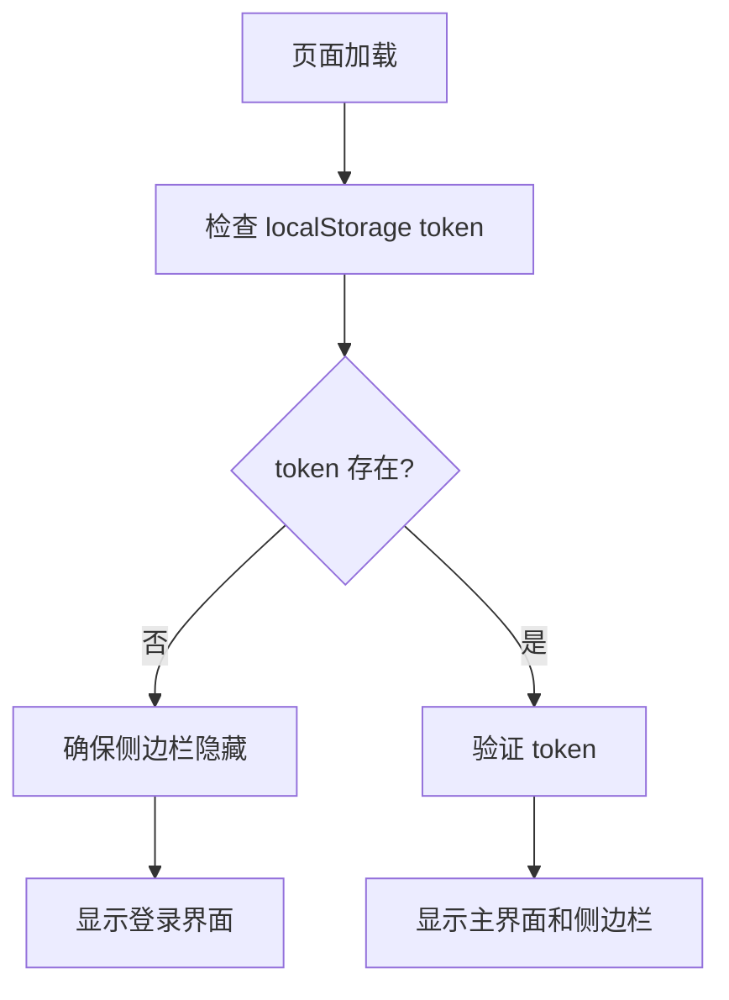

# 侧边栏显示问题修复

## 🐛 问题描述

**问题**：侧边栏在用户未登录的状态下依然显示

**影响**：
- 用户体验差：未登录用户看到不应该看到的界面元素
- 安全性问题：可能暴露应用的功能结构
- UI 混乱：登录界面与侧边栏同时显示

## 🔍 问题分析

### 原始代码结构

```html
<body>
    <div id="sidebar" class="sidebar">
        <!-- 侧边栏内容 -->
    </div>
    
    <div class="container">
        <div id="loginSection" class="card">
            <!-- 登录界面 -->
        </div>
        <div id="mainSection" class="main-content hidden">
            <!-- 主应用界面 -->
        </div>
    </div>
</body>
```

### 问题根源

1. **结构问题**：侧边栏在 DOM 中独立存在，不受 `mainSection` 的 `hidden` 状态影响
2. **CSS 问题**：侧边栏使用 `position: fixed`，相对于视口定位，始终可见
3. **逻辑问题**：没有在页面初始化时根据登录状态控制侧边栏显示

## ✅ 修复方案

### 1. 模板层修复

**修改位置**：`src/templates/html-template.ts`

#### 给侧边栏添加初始隐藏状态

```typescript
// 修复前
<div id="sidebar" class="sidebar">

// 修复后  
<div id="sidebar" class="sidebar hidden">
```

#### 在初始化时检查登录状态

```javascript
// 检查登录状态
const token = localStorage.getItem('cem_persist_token') || localStorage.getItem('token');
if (token) {
    // 有 token，验证并可能显示侧边栏
    if (window.AuthManager) {
        await window.AuthManager.checkAuth();
    }
} else {
    // 没有 token，确保侧边栏隐藏
    const sidebar = document.getElementById('sidebar');
    if (sidebar) {
        sidebar.classList.add('hidden');
    }
}
```

### 2. 逻辑层修复

**修改位置**：`src/static/app.ts`

#### 更新 `UI.openSidebar()` 方法

```typescript
// 修复前
openSidebar() {
    const sidebar = document.getElementById('sidebar');
    const mainContent = document.querySelector('.main-content');

    if (sidebar && mainContent && !State.sidebarOpen) {
        State.sidebarOpen = true;
        sidebar.classList.add('open');
        mainContent.classList.add('sidebar-open');
    }
}

// 修复后
openSidebar() {
    const sidebar = document.getElementById('sidebar');
    const mainContent = document.querySelector('.main-content');

    if (sidebar && mainContent) {
        // 显示侧边栏（移除 hidden 类）
        sidebar.classList.remove('hidden');
        
        if (!State.sidebarOpen) {
            State.sidebarOpen = true;
            sidebar.classList.add('open');
            mainContent.classList.add('sidebar-open');
        }
    }
}
```

#### 更新 `UI.closeSidebar()` 方法

```typescript
// 修复前
closeSidebar() {
    const sidebar = document.getElementById('sidebar');
    const mainContent = document.querySelector('.main-content');

    if (sidebar && mainContent && State.sidebarOpen) {
        State.sidebarOpen = false;
        sidebar.classList.remove('open');
        mainContent.classList.remove('sidebar-open');
    }
}

// 修复后
closeSidebar() {
    const sidebar = document.getElementById('sidebar');
    const mainContent = document.querySelector('.main-content');

    if (sidebar && mainContent) {
        // 隐藏侧边栏（添加 hidden 类）
        sidebar.classList.add('hidden');
        
        if (State.sidebarOpen) {
            State.sidebarOpen = false;
            sidebar.classList.remove('open');
            mainContent.classList.remove('sidebar-open');
        }
    }
}
```

## 🔄 修复后的工作流程

### 用户未登录时



### 用户登录时

```mermaid
graph TD
    A[用户登录成功] --> B[调用 UI.openSidebar()]
    B --> C[移除 sidebar 的 hidden 类]
    C --> D[添加 open 类]
    D --> E[显示侧边栏]
```

### 用户退出时

```mermaid
graph TD
    A[用户退出登录] --> B[调用 UI.closeSidebar()]
    B --> C[添加 sidebar 的 hidden 类]
    C --> D[移除 open 类]
    D --> E[隐藏侧边栏]
```

## 🎯 关键改进点

### 1. 双重隐藏机制

- **`hidden` 类**：控制侧边栏是否存在于界面中 (`display: none`)
- **`open` 类**：控制侧边栏的展开/收起动画效果

### 2. 状态管理优化

```typescript
// 现在的状态管理更加清晰
if (sidebar && mainContent) {
    // 先处理显示/隐藏
    sidebar.classList.remove('hidden');
    
    // 再处理展开/收起
    if (!State.sidebarOpen) {
        State.sidebarOpen = true;
        sidebar.classList.add('open');
        mainContent.classList.add('sidebar-open');
    }
}
```

### 3. 初始化安全性

```javascript
// 页面加载时就确保状态正确
if (!token) {
    // 没有 token，立即隐藏侧边栏
    const sidebar = document.getElementById('sidebar');
    if (sidebar) {
        sidebar.classList.add('hidden');
    }
}
```

## ✅ 测试验证

### 测试场景

1. **未登录用户访问**
   - ✅ 侧边栏完全隐藏
   - ✅ 只显示登录界面

2. **用户登录成功**
   - ✅ 侧边栏显示
   - ✅ 主界面显示
   - ✅ 登录界面隐藏

3. **用户退出登录**
   - ✅ 侧边栏隐藏
   - ✅ 主界面隐藏
   - ✅ 登录界面显示

4. **页面刷新**
   - ✅ 根据 token 状态正确显示/隐藏侧边栏

### CSS 支持

```css
.hidden {
    display: none !important;
}

.sidebar {
    position: fixed;
    left: -250px;
    /* 其他样式... */
}

.sidebar.open {
    left: 0;
}
```

## 📚 相关文件

- `src/templates/html-template.ts` - HTML 模板和初始化逻辑
- `src/static/app.ts` - 侧边栏控制逻辑
- `src/static/styles.ts` - CSS 样式定义

## 🔮 后续优化建议

1. **动画优化**：可以为 `hidden` 状态添加淡入淡出动画
2. **响应式优化**：在移动端可能需要不同的隐藏逻辑
3. **状态持久化**：可以考虑记住用户的侧边栏偏好设置

---

**修复完成**：侧边栏现在只在用户登录后才显示，提升了用户体验和安全性。