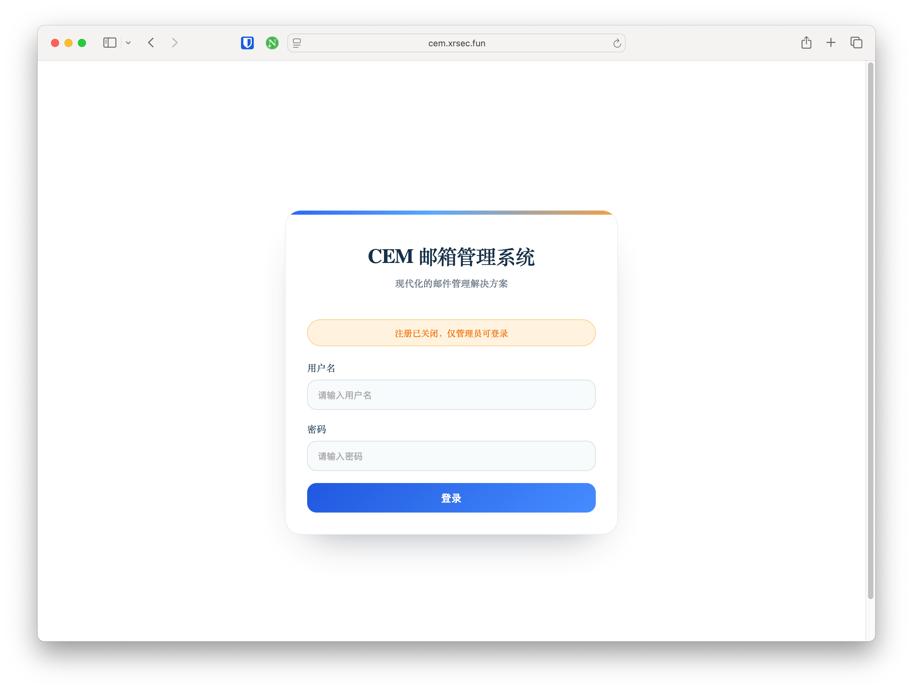
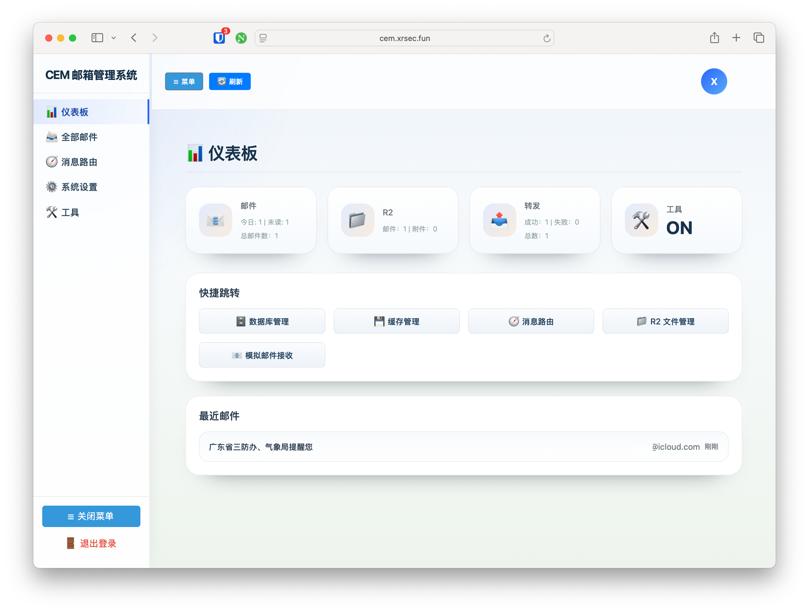
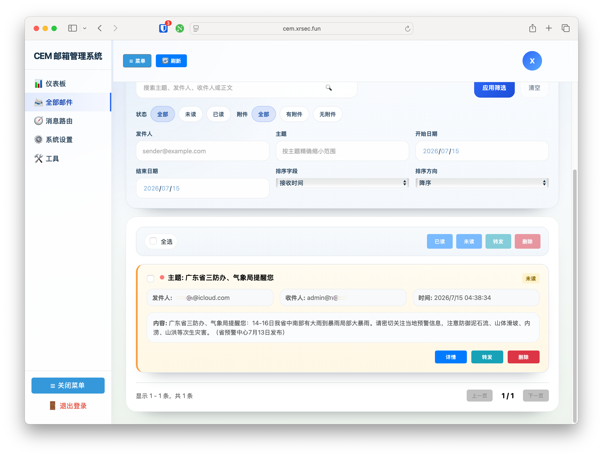
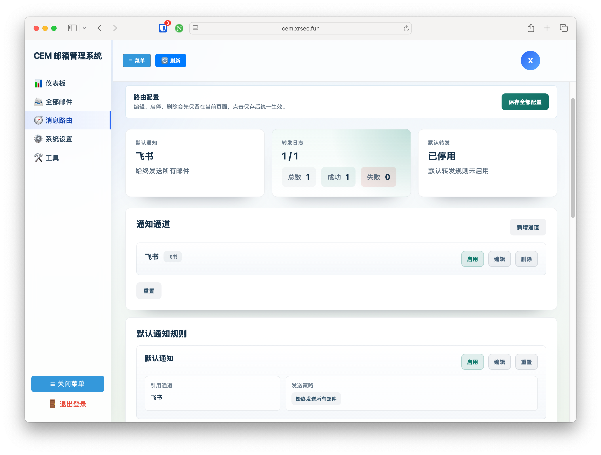
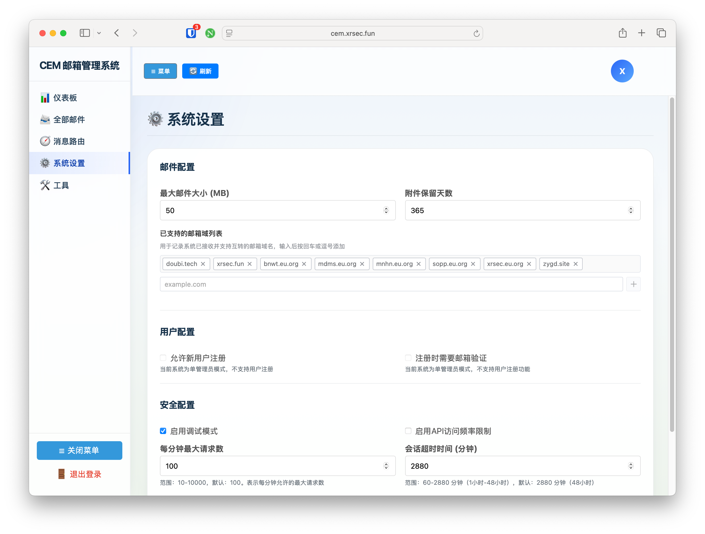
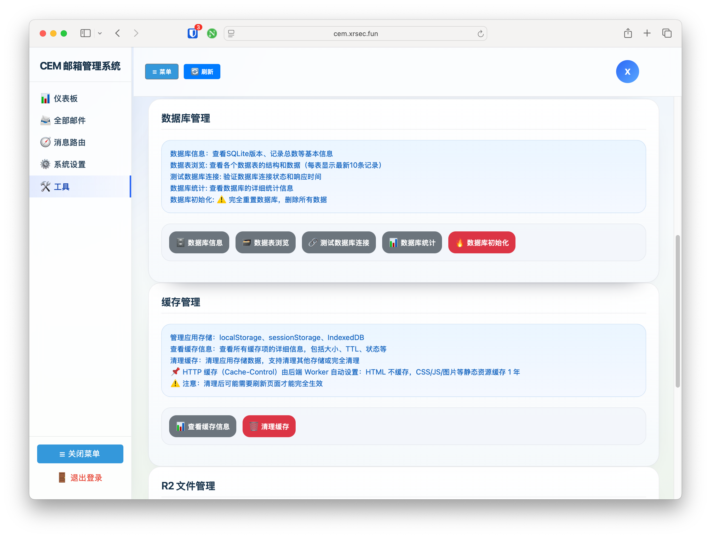

# Cloudflare Email Manager

基于 Cloudflare Workers 的邮箱管理系统。它可以接收 Cloudflare Email Routing 投递的邮件，并提供邮件查看、附件下载、消息通知、收件转发和
Webhook 调试能力。

如果你只是想部署和使用，请看本文档。开发、调试和配置细节请看 [DEVELOPERS.md](./DEVELOPERS.md)。

## 主要功能

- 接收 Cloudflare Email Routing 邮件
- 在管理后台查看邮件、附件和转发日志
- 使用 D1 存储邮件索引、设置、路由规则和日志
- 使用 R2 存储原始邮件和附件
- 使用 KV 缓存列表、详情和仪表板数据
- 支持钉钉、飞书、Bark 通知
- 支持按发件人、收件人、主题、正文匹配通知规则
- 支持默认通知规则和收件转发规则

## 界面预览

| 登录                               | 仪表盘                     | 
|----------------------------------|-------------------------|
|                |  |
| 邮件列表                             | 消息路由                    | 
|         |   | 
| 系统设置                             | 工具                      |
|             |       |
| 转发详情                             |                         |                           |
|  |                         |                           |

## 准备工作

你需要：

- Node.js `^20.19.0 || >=22.12.0`
- npm
- Cloudflare 账号
- 已登录 Wrangler

```bash
npx wrangler login
```

## 快速开始

安装依赖：

```bash
npm install
```

首次初始化并部署：

```bash
npm run init
```

该命令会自动创建或复用 D1、KV、R2，生成或更新 `wrangler.toml`，初始化数据库，构建前端并部署 Worker。

部署完成后，到 Cloudflare 控制台配置 Email Routing，把目标地址路由到这个 Worker。

默认管理员账号：

```text
admin / 123456
```

首次登录后请立即修改密码。

## 日常使用命令

本地开发：

```bash
npm run dev
```

构建前端：

```bash
npm run build
```

普通部署：

```bash
npm run deploy
```

注意：`npm run deploy` 只会构建并部署，不会创建 Cloudflare 资源，也不会初始化数据库。首次部署或资源变化时请使用
`npm run init`。

## 配置文件

项目使用根目录的 `wrangler.toml` 作为实际配置，`wrangler.example.toml` 是模板文件。

请根据自己的 Cloudflare 环境维护 `wrangler.toml` 中的资源 ID、域名和密钥类配置。不要把个人密钥或生产环境敏感配置提交到公开仓库。

## 常见注意事项

- 修改消息路由后，需要点击“保存全部配置”才会生效。
- 如果飞书没有开启签名校验，请清空通知通道里的密钥字段。
- 如果飞书返回 HTTP 200 但没有收到消息，请查看转发日志详情里的响应 body。
- Webhook 重发不会新增转发日志，结果会直接显示在本次调试输出中。

## 更多文档

- [DEVELOPERS.md](./DEVELOPERS.md)：开发、部署脚本、数据库、消息路由和调试细节
- [vue/README.md](./vue/README.md)：前端项目说明
