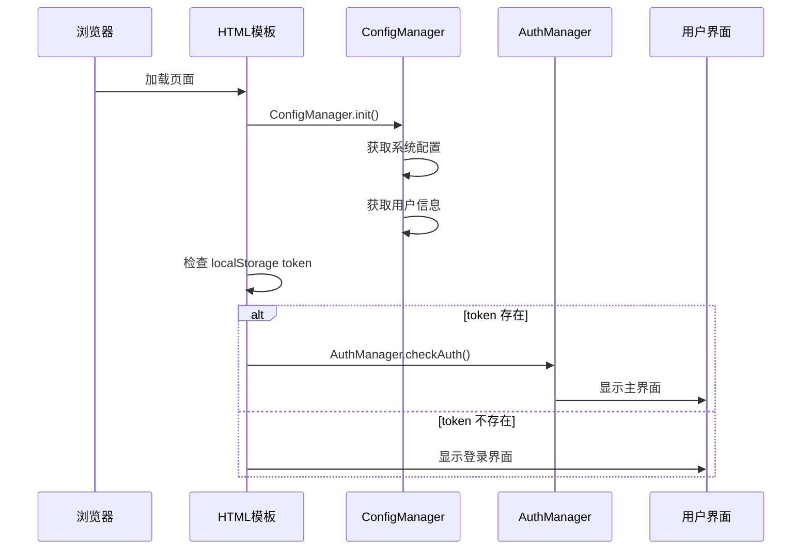

# Templates 使用指南

## 🚀 快速开始

### 基本使用

```typescript
import { getHTMLTemplate } from './templates/html-template';

// 生成完整的 HTML 页面
const html = await getHTMLTemplate();

// 在 Hono 中返回
return c.html(html);
```

## 🔧 错误修复案例

### 问题：JavaScript 函数未定义

**错误信息**：
```
ReferenceError: checkAuth is not defined
```

**原因分析**：
1. 在模板初始化代码中直接调用 `checkAuth()`
2. 但该函数定义在 `AuthManager.checkAuth()`
3. 执行时 `AuthManager` 可能还未初始化

**解决方案**：

#### 修复前（错误）：
```javascript
if (token) {
    checkAuth(); // ❌ 函数未定义
}
```

#### 修复后（正确）：
```javascript
if (token) {
    // 等待 AuthManager 初始化完成后再检查认证
    if (window.AuthManager) {
        await window.AuthManager.checkAuth();
    } else {
        // 如果 AuthManager 还未初始化，等待一下再尝试
        setTimeout(async () => {
            if (window.AuthManager) {
                await window.AuthManager.checkAuth();
            }
        }, 100);
    }
}
```

## 🏗️ 模板结构解析

### 1. HTML 头部 (`getHTMLHead()`)

```typescript
function getHTMLHead(): string {
    return `
    <meta charset="UTF-8">
    <meta name="viewport" content="width=device-width, initial-scale=1.0">
    <meta name="description" content="临时邮箱管理系统 - 安全、快速、便捷">
    <title>临时邮箱管理系统</title>
    ${getStyleTag()}  // 🎨 内联 CSS 样式
    `;
}
```

**作用**：
- 设置页面基础元信息
- 内联所有 CSS 样式
- 配置响应式视口

### 2. HTML 主体 (`getHTMLBody()`)

```typescript
function getHTMLBody(): string {
    return `
    <!-- 🔐 登录界面 -->
    <div id="loginSection" class="login-section">
        <!-- 登录表单 -->
    </div>

    <!-- 📧 主应用界面 -->
    <div id="mainSection" class="main-section hidden">
        <!-- 侧边栏和内容区域 -->
    </div>

    <!-- 📱 移动端优化 -->
    <div class="mobile-overlay"></div>
    `;
}
```

**作用**：
- 定义完整的页面结构
- 包含登录和主应用界面
- 响应式布局支持

### 3. JavaScript 脚本 (`getHTMLScript()`)

```typescript
function getHTMLScript(version: number): string {
    return `
    <script data-version="${version}">
        // 📊 配置管理器
        ${AppConfig}
        
        // 🚀 主应用逻辑  
        ${await getJavaScript()}
        
        // 🔄 初始化代码
        document.addEventListener('DOMContentLoaded', async function() {
            console.log('应用初始化...');
            
            // 初始化配置
            await ConfigManager.init();
            
            // 检查登录状态并启动应用
            // ...
        });
    </script>
    `;
}
```

**作用**：
- 集成所有 JavaScript 代码
- 处理应用初始化流程
- 版本控制和缓存管理

## 🔄 初始化流程



## 🐛 常见错误和解决方案

### 1. 函数未定义错误

**错误类型**：
- `checkAuth is not defined`
- `UI is not defined`
- `AuthManager is not defined`

**解决步骤**：

1. **确认函数导出**：
```typescript
// 在 app.ts 末尾添加全局导出
window.AuthManager = AuthManager;
window.UI = UI;
window.EmailManager = EmailManager;
```

2. **检查调用时机**：
```javascript
// ❌ 错误：立即调用
if (token) {
    AuthManager.checkAuth();
}

// ✅ 正确：检查是否已初始化
if (token && window.AuthManager) {
    await window.AuthManager.checkAuth();
}
```

3. **使用延迟加载**：
```javascript
// 等待模块加载完成
setTimeout(async () => {
    if (window.AuthManager) {
        await window.AuthManager.checkAuth();
    }
}, 100);
```

### 2. 样式不显示

**可能原因**：
- `getStyleTag()` 函数有误
- CSS 内容为空
- CSP 阻止内联样式

**检查方法**：
```typescript
// 调试样式生成
console.log('Generated styles:', getStyleTag());
```

### 3. 配置加载失败

**错误信息**：
```
Failed to load system config
```

**解决方案**：
```typescript
// 添加错误处理
try {
    await ConfigManager.init();
} catch (error) {
    console.error('配置初始化失败:', error);
    // 显示错误界面或使用默认配置
}
```

## 🎯 最佳实践

### 1. 错误处理

```javascript
document.addEventListener('DOMContentLoaded', async function() {
    try {
        console.log('应用初始化...');
        
        // 初始化配置
        await ConfigManager.init();
        
        // 检查认证状态
        const token = localStorage.getItem('cem_persist_token') || localStorage.getItem('token');
        if (token && window.AuthManager) {
            await window.AuthManager.checkAuth();
        }
    } catch (error) {
        console.error('应用初始化失败:', error);
        // 显示错误信息给用户
        document.body.innerHTML = `
            <div class="error-message">
                <h1>应用加载失败</h1>
                <p>请刷新页面重试</p>
                <button onclick="location.reload()">刷新页面</button>
            </div>
        `;
    }
});
```

### 2. 性能优化

```javascript
// 使用 requestAnimationFrame 优化渲染
if (token && window.AuthManager) {
    requestAnimationFrame(async () => {
        await window.AuthManager.checkAuth();
    });
}
```

### 3. 调试支持

```javascript
// 开发模式下的调试信息
if (window.location.hostname === 'localhost') {
    window.DEBUG = true;
    console.log('Debug mode enabled');
    console.log('Available managers:', {
        AuthManager: !!window.AuthManager,
        UI: !!window.UI,
        ConfigManager: !!window.ConfigManager
    });
}
```

## 📝 模板自定义

### 1. 修改页面标题

```typescript
// 在 getHTMLHead() 中修改
<title>你的应用名称</title>
```

### 2. 添加自定义 Meta 标签

```typescript
function getHTMLHead(): string {
    return `
    <!-- 基础标签 -->
    <meta charset="UTF-8">
    <meta name="viewport" content="width=device-width, initial-scale=1.0">
    
    <!-- 自定义 Meta 标签 -->
    <meta name="author" content="Your Name">
    <meta name="keywords" content="email, temporary, management">
    <meta property="og:title" content="临时邮箱管理系统">
    <meta property="og:description" content="安全、快速、便捷的临时邮箱解决方案">
    
    <title>临时邮箱管理系统</title>
    ${getStyleTag()}
    `;
}
```

### 3. 添加 Favicon

```typescript
// 在 head 中添加
<link rel="icon" type="image/x-icon" href="data:image/x-icon;base64,AAABAAEAEBAAAAEAIABoBAAAFgAAACgAAAAQAAAAIAAAAAEAIAAAAAAAAAQAABILAAASCwAAAAAAAAAAAAA=">
```

## 🔮 高级用法

### 1. 条件渲染

```typescript
export async function getHTMLTemplate(options?: {
    theme?: 'light' | 'dark';
    mobile?: boolean;
    debug?: boolean;
}): Promise<string> {
    const version = new Date().getTime();
    const theme = options?.theme || 'light';
    
    return `<!DOCTYPE html>
<html lang="zh-CN" data-theme="${theme}">
<head>
    ${getHTMLHead()}
</head>
<body class="${options?.mobile ? 'mobile' : 'desktop'}">
    ${getHTMLBody()}
    ${getHTMLScript(version, options?.debug)}
</body>
</html>`;
}
```

### 2. 模板缓存

```typescript
const templateCache = new Map<string, string>();

export async function getHTMLTemplate(cacheKey?: string): Promise<string> {
    if (cacheKey && templateCache.has(cacheKey)) {
        return templateCache.get(cacheKey)!;
    }
    
    const html = await generateHTMLTemplate();
    
    if (cacheKey) {
        templateCache.set(cacheKey, html);
    }
    
    return html;
}
```

---

**提示**：修改模板后，记得清除浏览器缓存以查看最新效果！